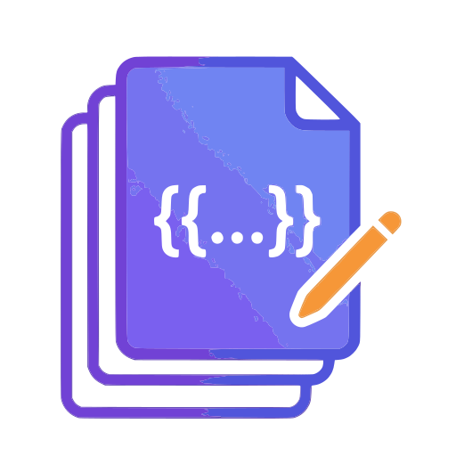

<p align="center">
  
</p>

<h1 align="center">Prompt Manager</h1>

<p align="center">
  <strong>Your prompt workshop as a desktop app.</strong><br/>
  Create templates, fill in placeholders, copy your prompt — done.
</p>

<p align="center">
  
  
  
  
  
</p>

---

## What is Prompt Manager?

Prompt Manager is a lightweight desktop application for creating, organizing, and assembling **reusable prompt templates** in seconds.

Instead of rewriting the same prompt every time, you define a template once — with placeholders, optional blocks, and either/or groups — and simply fill in the blanks when you need it. One click copies the finished prompt to your clipboard.

**Fully offline.** All data stays local on your machine.

---

## Features

### Templates with Dynamic Placeholders

Write template bodies using `{{name}}` placeholder syntax. When using a template, input fields are automatically generated for each placeholder. Each placeholder can be configured as one of four types:

| Type | Description |
|------|-------------|
| **Input** | Single-line text field (default) |
| **Textarea** | Multi-line text area for longer content |
| **Liste** | Formatted list — add entries one by one, output as `- item` lines |
| **Auswahl** | Dropdown with predefined options (custom text and/or snippet references) |

### Optional Variables & Block Syntax

Mark any placeholder as **optional** to get a toggle button ("an"/"aus") in the builder. When disabled, the line containing that placeholder is removed from the output.

For more control, wrap surrounding text in block markers:
```
{{#varname}}This text with {{varname}} is only included when enabled.{{/varname}}
```
Disabling the variable removes the entire block — not just the placeholder line.

**Standalone blocks** (without a matching `{{varname}}` inside) work as pure section toggles:
```
{{#disclaimer}}This entire disclaimer section can be toggled on/off.{{/disclaimer}}
```

### Optional Blocks (Appendable)

Define optional text blocks (e.g. *"Keep comments minimal"*) that can be toggled on or off via checkboxes when building a prompt. Reorder them with up/down buttons, edit their text inline at any time. These are appended to the end of the prompt.

### Either / Or Groups

Create groups of mutually exclusive options rendered as radio buttons. Exactly one option per group is included in the final prompt.

### Snippets & Constants

Create reusable text fragments with a key (`[[key]]`). Reference them in any number of templates — Prompt Manager expands them automatically at build time. An autocomplete dropdown appears in the editor as soon as you type `[[`. The same autocomplete works for block markers when typing `{{#` or `{{/`.

### Auto-Backup

On app startup, Prompt Manager automatically checks if a weekly backup is needed (Monday-based check). Backups are saved as JSON files to a configurable folder (default: `./backup` next to the executable). The backup panel in the template list header lets you:

- Enable/disable auto-backup
- Choose a custom backup folder via native OS dialog
- Trigger a manual backup at any time

### Multi-Category System

Assign one or more categories to each template. Filter your template list by category pill or search by name. Favorites are pinned to the top.

### Export & Import

Export selected templates as a JSON file — referenced snippets are automatically bundled. Import files from colleagues without creating duplicates.

### Prompt History

The last 50 generated prompts are saved with timestamps. View, copy, or delete them at any time.

### Dark & Light Theme

Switch themes with a single button. Your preference is persisted and synced to the native title bar.

### Global Shortcut

**`Ctrl + 1`** toggles the app window — no matter which window currently has focus.

---

## How Does It Work?

```
+----------------+    +--------------------+    +--------------------+
| Template List  |    | Template Editor    |    | Prompt Builder     |
|                |--->|                    |    |                    |
| Search         |    | Name & Body        |    | Fill in            |
| Filter         |    | {{Placeholders}}   |    | placeholders       |
| Favorites      |    | [[Snippets]]       |    |                    |
| Export         |    | Optionals          |    | Toggle options     |
| Import         |    | Either/Or          |    |                    |
|                |--->| Categories         |    | Live preview       |
|                |    +--------------------+    |                    |
|                |----------------------------->| -> Copy            |
+----------------+                              +--------------------+
```

### Workflow

1. **Create a template** — In the editor, give it a name, write the body with `{{placeholder}}` syntax, and add optional blocks or either/or groups.
2. **Use a template** — Click a template in the list. The Prompt Builder shows input fields for every placeholder, checkboxes for optionals, and radio buttons for either/or groups.
3. **Copy the prompt** — The live preview shows the assembled prompt in real time. One click copies it to your clipboard and saves it to the history.

### Prompt Assembly Pipeline

The builder processes the template in this order:

| Step | Action | Syntax |
|------|--------|--------|
| 1 | Remove disabled blocks | `{{#name}}...{{/name}}` → removed entirely |
| 2 | Strip enabled block markers | `{{#name}}` / `{{/name}}` → removed, content kept |
| 3 | Remove disabled optional lines | Lines with disabled `{{name}}` → removed |
| 4 | Snippet expansion | `[[key]]` → stored text |
| 5 | Placeholder substitution | `{{name}}` → user input / list / choicelist value |
| 6 | Append optionals | Checked optional blocks are appended |
| 7 | Append either/or | Selected radio option per group is appended |

### Data Storage

All data is stored exclusively in the **localStorage** of the Tauri WebView — no server, no database, no cloud.

| Key | Content |
|-----|---------|
| `prompt-manager-templates` | All templates (JSON) |
| `prompt-manager-snippets` | All snippets (JSON) |
| `prompt-manager-history` | Last 50 prompts (JSON) |
| `pm-theme` | Active theme (`light` / `dark`) |
| `pm-backup-settings` | Backup configuration (enabled, folder path) |
| `pm-last-backup` | ISO timestamp of last auto-backup |

---

## Tech Stack & Architecture

### Architecture Overview

```
+--------------------------------------------+
| Tauri Shell                                |
|                                            |
|  +--------------------------------------+  |
|  | Svelte Frontend                      |  |
|  |                                      |  |
|  |  SvelteKit <--> Svelte Stores        |  |
|  |  (Routing)      (Reactive State)     |  |
|  |      |               |               |  |
|  |      v               v               |  |
|  |  Components      localStorage        |  |
|  |  (UI Layer)      (Persistence)       |  |
|  +--------------------------------------+  |
|                    ^                       |
|                    | IPC (minimal)         |
|  +--------------------------------------+  |
|  | Rust Backend                         |  |
|  |                                      |  |
|  |  Window Management                   |  |
|  |  Global Shortcut (Ctrl+1)            |  |
|  |  Native Title Bar & Theme Sync       |  |
|  +--------------------------------------+  |
+--------------------------------------------+
```

### Frontend

| Technology | Version | Role |
|------------|---------|------|
| **Svelte** | 5 | Reactive UI framework — components, transitions, store bindings |
| **SvelteKit** | 2.9 | Meta-framework with routing and static adapter (SPA mode) |
| **TypeScript** | 5.6 | Type safety for interfaces, stores, and utility functions |
| **Vite** | 6 | Lightning-fast dev server with HMR and optimized production builds |

**State management** is handled through custom Svelte stores in `store.ts`. Each store (Templates, Snippets, History) encapsulates load, save, and mutation logic, automatically persisting changes to localStorage. Derived stores like `categories` and `snippetMap` reactively compute their values from the base stores.

**View routing** is controlled in `+page.svelte` via a simple state variable (`view: "list" | "edit" | "use" | "snippets" | "history"`) — no URL-based routing needed since the app is a single-window desktop tool.

### Backend (Rust / Tauri)

| Technology | Version | Role |
|------------|---------|------|
| **Tauri** | 2 | Desktop runtime — bundles the frontend into a native window |
| **Rust** | Edition 2021 | Compiled backend for window control and shortcut handling |
| **serde / serde_json** | 1 | Serialization for IPC communication |

The Rust backend is intentionally minimal. It only handles tasks that a pure web frontend cannot:

- **Global shortcut** (`Ctrl+1`): Registers system-wide and toggles the app window
- **Theme sync**: Sets the native title bar theme to match the app theme
- **Plugin initialization**: Activates the `global-shortcut`, `opener`, `fs`, and `dialog` plugins on startup
- **File system access**: The `fs` plugin enables auto-backup to write JSON files to disk
- **Native dialogs**: The `dialog` plugin provides the OS folder picker for backup configuration

All business logic — template management, prompt assembly, export/import — runs entirely in the frontend.

### How They Work Together

1. **Tauri** launches a native window and loads the **SvelteKit** frontend built by **Vite**
2. **SvelteKit** renders the UI as a single-page app (static adapter, SSR disabled)
3. **Svelte Stores** load data from **localStorage** and maintain the reactive state
4. User interactions flow through **Svelte components** → **store mutations** → **localStorage persistence**
5. For native features (shortcut, title bar), the frontend communicates with the **Rust backend** via **Tauri IPC**

---

## Project Structure

```
prompt-manager/
├── src/                          # Frontend source code
│   ├── routes/                   # SvelteKit pages
│   │   ├── +page.svelte          # Main view router
│   │   ├── +layout.svelte        # Theme setup & title bar sync
│   │   └── +layout.ts            # SPA configuration (SSR disabled)
│   ├── lib/                      # Components & state
│   │   ├── store.ts              # Svelte stores, interfaces, utilities
│   │   ├── TemplateList.svelte   # Overview, search, filter, export/import
│   │   ├── TemplateEditor.svelte # Create & edit templates
│   │   ├── PromptBuilder.svelte  # Fill placeholders & copy prompt
│   │   ├── SnippetManager.svelte # Snippet management (CRUD)
│   │   ├── PromptHistory.svelte  # View prompt history
│   │   └── backup.ts            # Auto-backup service (settings, scheduling, file I/O)
│   ├── app.css                   # Global styles (light/dark themes)
│   └── app.html                  # HTML shell
│
├── src-tauri/                    # Rust backend
│   ├── src/
│   │   ├── main.rs               # Entry point
│   │   └── lib.rs                # App setup (shortcuts, theme, plugins)
│   ├── Cargo.toml                # Rust dependencies
│   ├── tauri.conf.json           # App configuration (window, icons, ID)
│   ├── icons/                    # App icons (PNG, ICO, ICNS)
│   └── capabilities/             # Tauri security policies
│
├── package.json                  # Scripts & frontend dependencies
├── vite.config.js                # Vite configuration
├── svelte.config.js              # SvelteKit configuration
├── tsconfig.json                 # TypeScript configuration
└── LICENSE                       # MIT License
```

---

## Development

### Prerequisites

- [Node.js](https://nodejs.org/) (LTS)
- [Rust](https://www.rust-lang.org/tools/install)
- [Tauri CLI](https://tauri.app/start/)

### Getting Started

```bash
# Install dependencies
npm install

# Start dev server (frontend only, http://localhost:1420)
npm run dev

# Start full desktop app in dev mode
npm run tauri dev
```

### Building

```bash
# Build frontend
npm run build

# Build complete desktop app (installer + executable)
npm run tauri build
```

### Type Checking

```bash
npm run check         # One-time
npm run check:watch   # Continuous
```

---

## License

GPL-3.0 — see [LICENSE](LICENSE)

<p align="center"><sub>Built with Tauri, Svelte, and a pinch of Rust.</sub></p>
